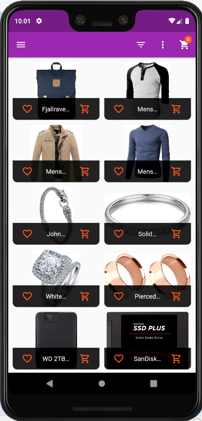
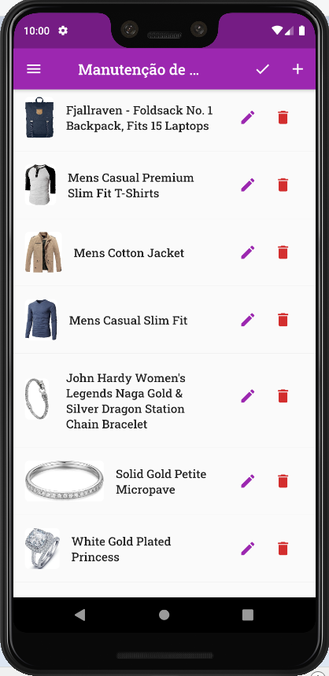

# Shopping Challenge

**Lista de Produtos**

Aplicação que permite você criar, listar, editar, deletar e favoritar seus produtos, adicionar items ao seu carrinho e criar listas de compras a partir dos mesmos.

---

### Tecnologia Utilizada:

#### Flutter

---

---

## Instalação | Execução

Clone esse repositório rodando o comando:

    git clone https://github.com/MarthinKorb/shopping_cart.git

---

# Sobre o ## Flutter

É um Framework de Dart para construir aplicações para a plataforma Android e Ios.

Quer saber mais sobre o _Flutter_? Acesse [https://flutter.dev/]

**Feito!** ✔

---
